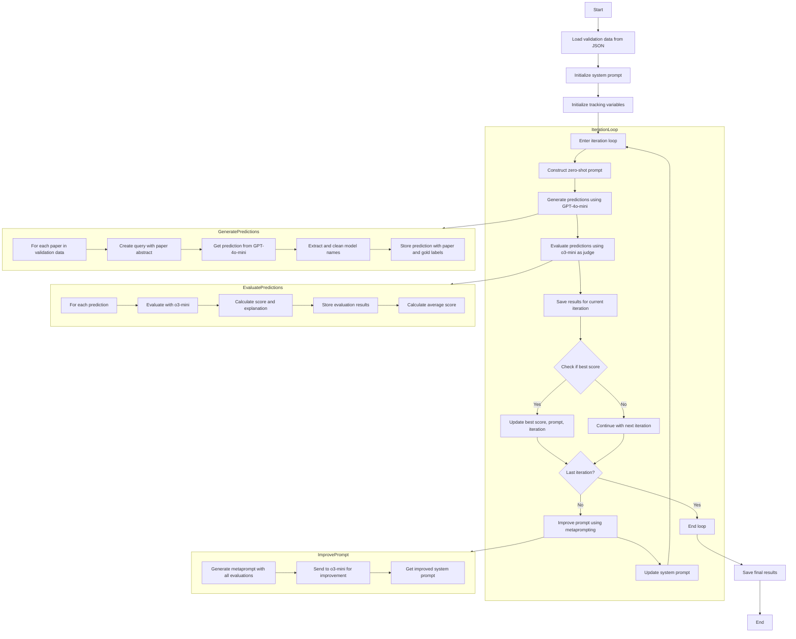

```mermaid
flowchart TD
    A[Start] --> B[Load validation data from JSON]
    B --> C[Initialize system prompt]
    C --> D[Initialize tracking variables]
    D --> E[Enter iteration loop]
    
    subgraph IterationLoop
        E --> F[Construct zero-shot prompt]
        F --> G[Generate predictions using GPT-4o-mini]
        G --> H[Evaluate predictions using o3-mini as judge]
        H --> I[Save results for current iteration]
        I --> J{Check if best score}
        J -->|Yes| K[Update best score, prompt, iteration]
        J -->|No| L[Continue with next iteration]
        
        K --> M{Last iteration?}
        L --> M
        M -->|No| N[Improve prompt using metaprompting]
        N --> O[Update system prompt]
        O --> E
        M -->|Yes| P[End loop]
    end
    
    P --> Q[Save final results]
    Q --> R[End]
    
    subgraph GeneratePredictions
        G1[For each paper in validation data]
        G2[Create query with paper abstract]
        G3[Get prediction from GPT-4o-mini]
        G4[Extract and clean model names]
        G5[Store prediction with paper and gold labels]
        
        G1 --> G2 --> G3 --> G4 --> G5
    end
    
    subgraph EvaluatePredictions
        H1[For each prediction]
        H2[Evaluate with o3-mini]
        H3[Calculate score and explanation]
        H4[Store evaluation results]
        H5[Calculate average score]
        
        H1 --> H2 --> H3 --> H4 --> H5
    end
    
    subgraph ImprovePrompt
        N1[Generate metaprompt with all evaluations]
        N2[Send to o3-mini for improvement]
        N3[Get improved system prompt]
        
        N1 --> N2 --> N3
    end
    
    G --> GeneratePredictions
    H --> EvaluatePredictions
    N --> ImprovePrompt
```
